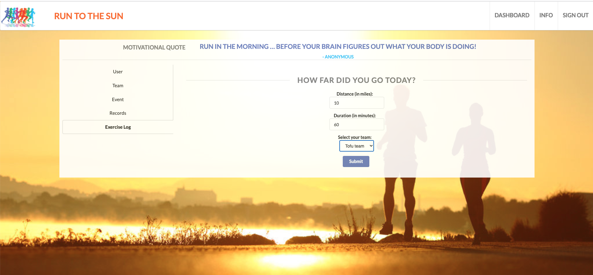

# Run to the sun

[Run to the sun](https://runtothesun.herokuapp.com/)

## Description

In times like these, with the world environment changing so often, we need to be adaptable. Adaptable to working from home, juggling a full-time job while home schooling children, and distancing ourselves from friends and family.

Group exercises, classes and bootcamps have been a huge success over the past several years, it’s motivating to feed off the energy of the class and push yourself to new limits with your classmates. However, the recent social distancing guidance has made group classes impossible, which has caused people to shift to virtual group classes and events. Run to the sun is designed to allow runners to participate in team based virtual relays, where you specify a location you want to “run” to (i.e. San Francisco to New York or 2,900 miles), as a team you track your individual runs until the combined miles equal your goal. Upon reaching your goal you can celebrate by traveling to your desired location as a group, once social distancing restrictions are lifted. The travel aspect will allow for the monetization of the app through integration with third party travel agencies using a revenue share model. This app will keep you motivated to work out, help you stay in-touch with your friends and eagerly anticipate the end of social distancing with a group vacation.

Aspects included: dashboard of user stats, team information, current event, record, and an exercise log.

"Alone we can do so little, together we can do so much." --Helen Keller-- 

## Technologies

* MongoDB
* Express
* React
* Redux
* Node.js
* Semantic UI React
* HTML5
* CSS3
* JavaScript

## Challenges

* Aggregating and summing information from the database is something new we’d never done before, but we needed to do it in order to check if the race was finished. 
* Using redux, redux-form, and mapping state to the props for the first time. We ran into a few challenges with this process until we’d done it a few times and absorbed the pattern and workflow for putting information into and grabbing information from the state.
* Inter-relationships between schemas and seed data.
* Routing: to use react router or conditional rendering?

## Directions for future Development

* Add ability for users to create events.
* Add multi-event support.
* Add OAuth so users can login with Facebook, Google, etc.
* Add social media elements so users can interact.
* Add ability for teams to challenge other teams.

## Screenshots

## Credits

Thank you to Berkeley Coding Bootcamp, our instructor Emmanual Jucaban, and our TAs Musa Akbari and Sergio Di Martino for answering all our questions and helping us along the way.

Collaborators on this project include:
* [Christina Leung](https://github.com/cgleungsf)
* [Tassia Shibuya](https://github.com/Tassim)
* [Emmett Brady](https://github.com/emmbra)

## License

This project is licensed under the [MIT License](https://choosealicense.com/licenses/mit).